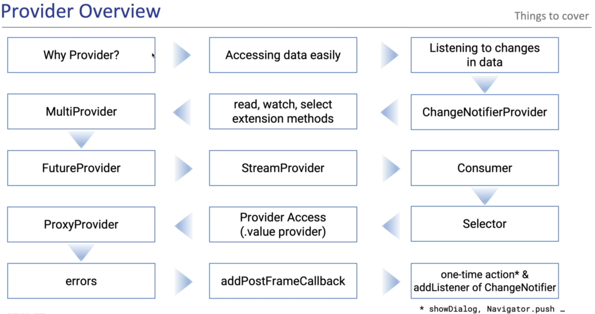

# Provider Tutorial - [Udemy](https://freecoursesites.com/flutter-provider-essential-course-english/)

</img>
Provider

```
> A recommended approach (in flutter .dev)
    - It gives the impression of Google certified
> Currently, it is the most used solution
> It has been tested very much in the field
    - Very stable solution
```

## Slides:

</img>

## Table of Contents

<table align="center" style="margin: 0px auto;">
  <tr>
    <th>No.</th>
    <th>Name of the App</th>
    <th>Screenshots</th>
  </tr>
  <tr>
    <td>1</td>
    <td><a href="/lib/1_neumorphic/neumorphism.dart">TODO App</a></td>
    <td></img></td>
  </tr>

</table>
