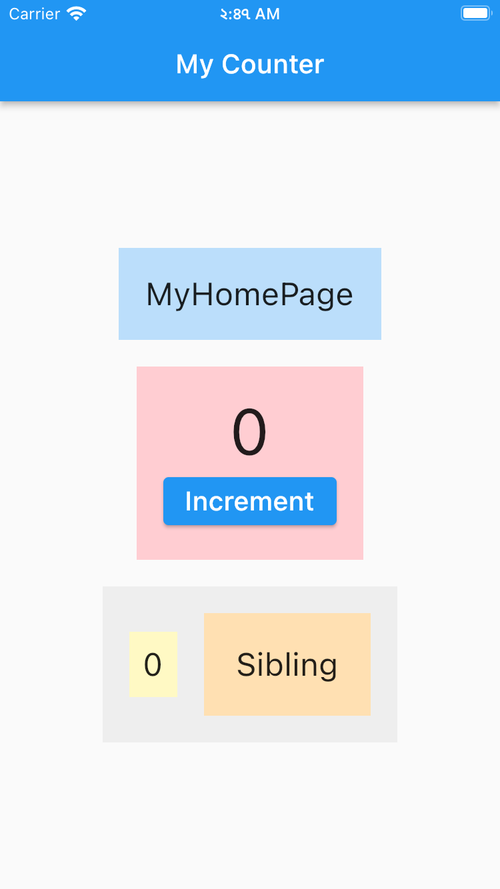

# Provider Tutorial - [Udemy](https://freecoursesites.com/flutter-provider-essential-course-english/)

</img>
Provider

```
  > A recommended approach (in flutter .dev)
      - It gives the impression of Google certified
  > Currently, it is the most used solution
  > It has been tested very much in the field
      - Very stable solution
```

## Slides:

</img>

## Table of Contents

<table align="center" style="margin: 0px auto;">
  <tr>
    <th>No.</th>
    <th>Name of the App</th>
    <th>README.md</th>
    <th>Screenshots</th>
  </tr>
  <tr>
    <td>1</td>
    <td><a href="/lib/0_provider_overview/provider_overview_01/counter.dart">Counter App</a></td>
    <td><a href="/lib/0_provider_overview">README.md</a></td>
    <td></img></td>
  </tr>

</table>

## Directory

```
  lib
  ├── 0_provider_overview
  │   ├── img
  │   │   ├── caution.png
  │   │   ├── changenotifier.png
  │   │   ├── changenotifierprovider.png
  │   │   ├── consumer.png
  │   │   ├── future_provider.png
  │   │   ├── multiple_providers.png
  │   │   ├── provider_constructor.png
  │   │   ├── provider_extension_methods.png
  │   │   ├── ProviderNotFoundException.png
  │   │   ├── selector.png
  │   │   ├── So far.png
  │   │   ├── stream_builder.png
  │   │   ├── update_callback_of_ProxyProvider.png
  │   │   ├── update_callback_of_ProxyProvider2.png
  │   │   ├── update_callback_of_ProxyProviderN.png
  │   │   ├── widget_tree_01.png
  │   │   └── widget_tree_02.png
  │   ├── provider_overview_01
  │   │   └── counter.dart
  │   ├── provider_overview_02
  │   │   ├── models
  │   │   │   └── dog.dart
  │   │   └── dog_app.dart
  │   ├── provider_overview_03
  │   │   ├── models
  │   │   │   └── dog.dart
  │   │   └── dog_app.dart
  │   ├── provider_overview_04
  │   │   ├── models
  │   │   │   └── dog.dart
  │   │   └── dog_app.dart
  │   ├── provider_overview_05
  │   │   ├── models
  │   │   │   └── dog.dart
  │   │   └── dog_app.dart
  │   ├── provider_overview_06
  │   │   ├── models
  │   │   │   ├── babied.dart
  │   │   │   └── dog.dart
  │   │   └── dog_app.dart
  │   ├── provider_overview_07
  │   │   ├── models
  │   │   │   ├── babied.dart
  │   │   │   └── dog.dart
  │   │   └── dog_app.dart
  │   ├── provider_overview_08
  │   │   ├── models
  │   │   │   └── dog.dart
  │   │   └── dog_app.dart
  │   ├── provider_overview_09
  │   │   └── consumer.dart
  │   ├── provider_overview_10
  │   │   ├── models
  │   │   │   └── dog.dart
  │   │   └── dog_app.dart
  │   ├── provider_overview_11
  │   │   ├── count_notifier.dart
  │   │   └── counter.dart
  │   └── README.md
  ├── 1_todo_app
  │   ├── providers
  │   │   └── provider.dart
  │   └── views
  │       └── home_page.dart
  ├── main.dart
  └── routes.dart
```