# Provider Overview

1. What is provider?

```
    A provider provides a tool to manage state, but does not enforce a specific method.
```

2. What kinds of providers are there?
3. How to use providers?
4. Provider related errors and how to avoid them?
5. What are provider's usage tips?

Note: It uses Equatable package. Dart data class generator extension.

## Widget tree for the CounterApp (Overview 01)

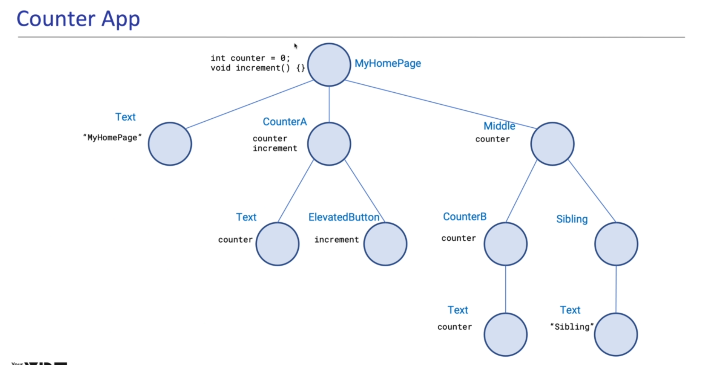</img>

## StateManagement

1. Dependency Injection
2. Synchronizing data and UI

## Widget tree for the Overview 02 App

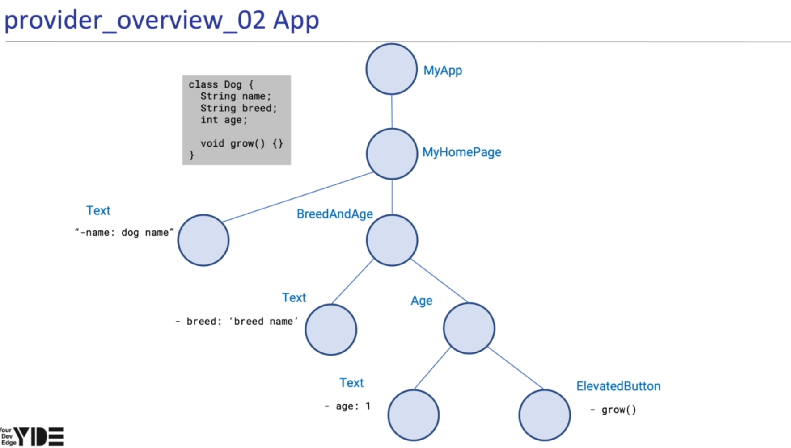</img>

# Provider constructor

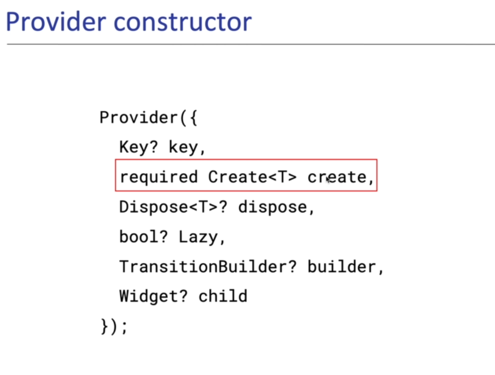</img>

Giving instance

```
Provider.of<T>(context) => T Tyle instance
```

# ChangeNotifier

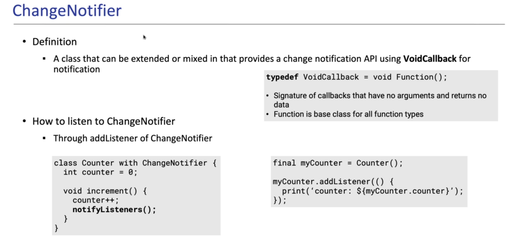</img>

# Caution

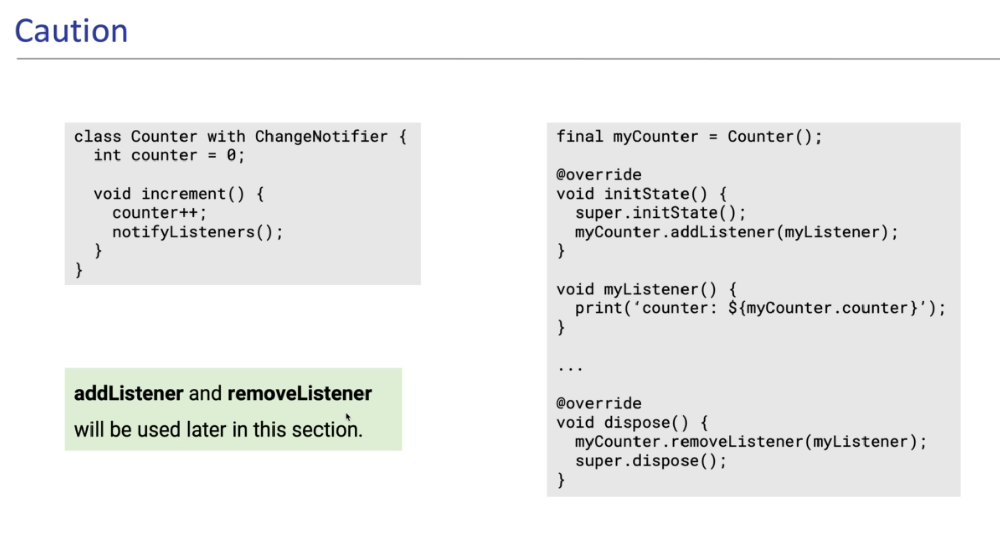</img>

# ChangeNotifierProvider

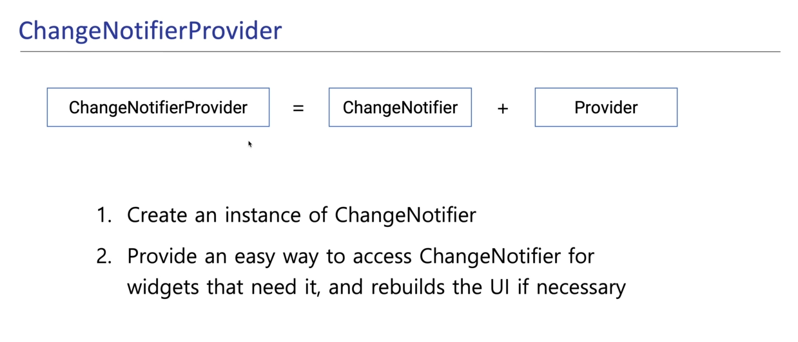</img>

# Provider Extension Methods

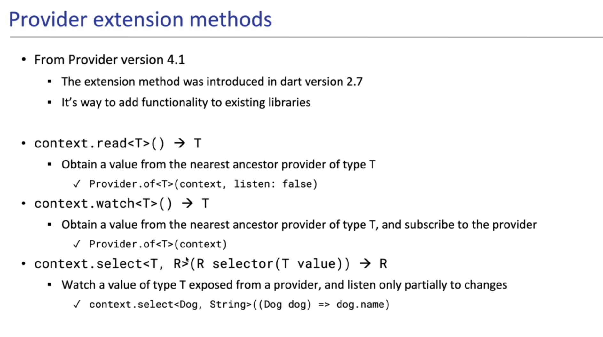</img>

# Multiple Providers

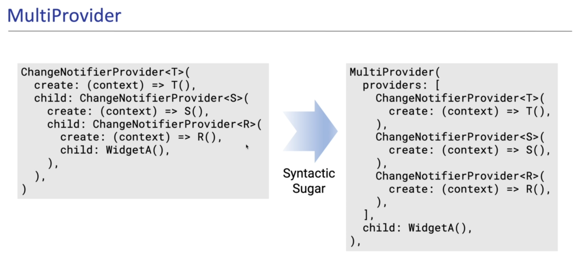</img>

# Future Provider

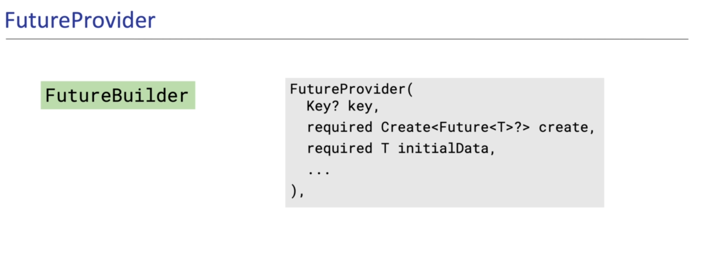</img>

# Stream Builder

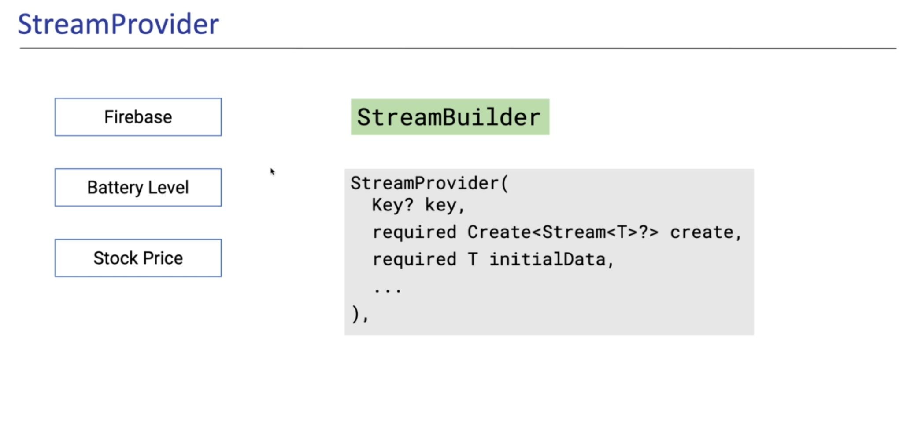</img>

# So far...

</img>

# Consumer

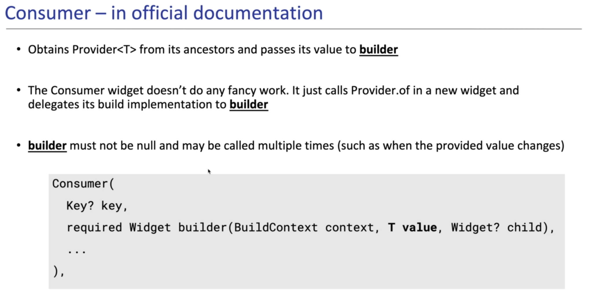</img>

# Selector

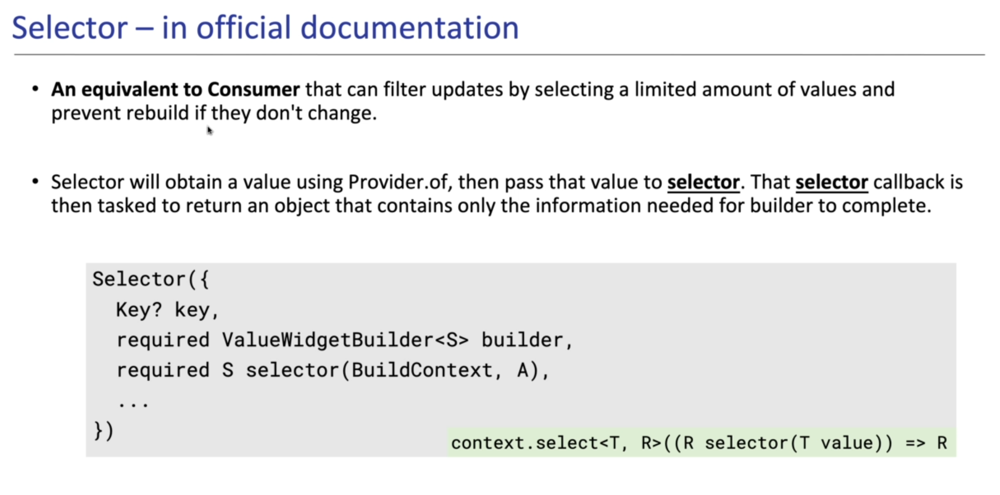</img>
