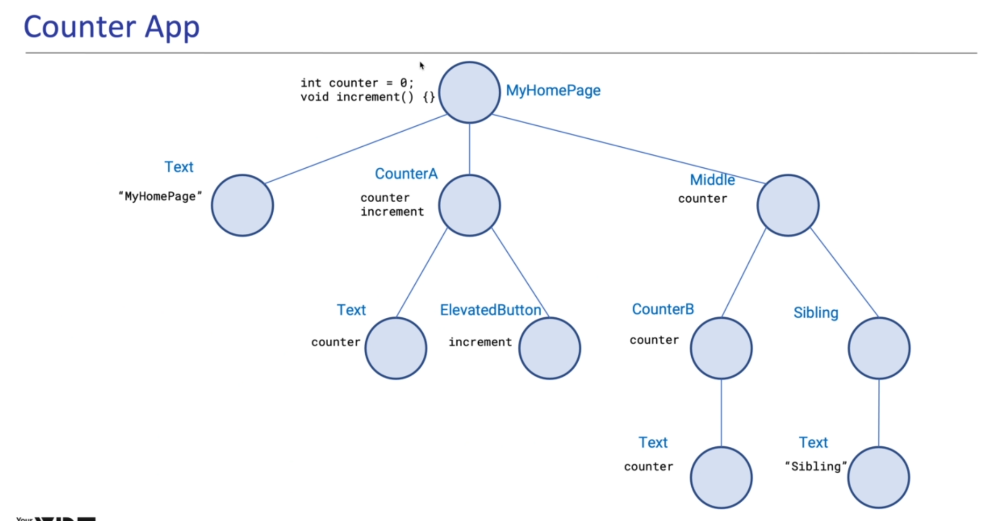

# Provider Overview

1. What is provider?

```
    A provider provides a tool to manage state, but does not enforce a specific method.
```

2. What kinds of providers are there?
3. How to use providers?
4. Provider related errors and how to avoid them?
5. What are provider's usage tips?

Note: It uses Equatable package. Dart data class generator extension.

## Widget tree for the CounterApp

</img>

## StateManagement
1. Dependency Injection
2. Synchronizing data and UI
